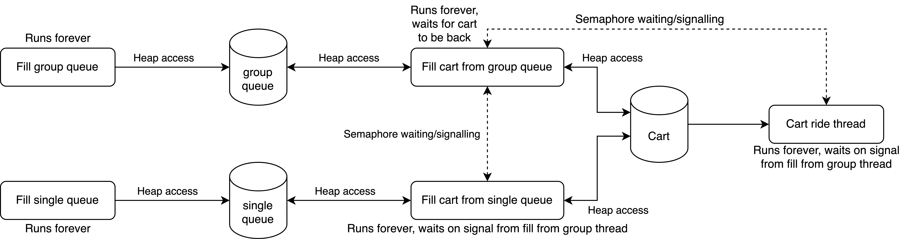
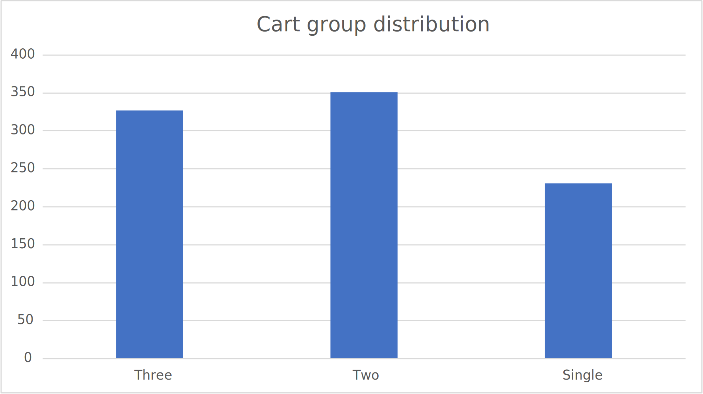

# semaphores - OS2
Camiel Verdult & Marnix Laar

## Introduction

A roller-coaster's queues have been split into two queues. A queue with groups of 2 or 3 people, and a queue with single riders. The carts of the rollercoaster fit 6 people in a row.
Our job is to write a piece of software that keeps track of the queues and fills the carts with groups first, and finishes off with single riders.

## Methodology

To keep track of queues and carts, we have 5 variables on the program heap with infinite lifetime. One of these is the cart, two are semaphores for thread flow control and two are for the group and single queues.

These semaphores can be waited (`sem_wait`) and signaled (`sem_signal`) to inform a thread/process to continue/pause operation. This waiting and signalling of other threads/processes prevents possible deadlocking of the program by ensuring sequential thread flow.

A general overview of the program is depicted in the diagram below.

Different threads have different access to the heap. The combination of the access to the heap and the semaphore communication between threads allows for smooth operation of the program.

## Testing

For verifying that this program works for longer periods of time or when threads run at different speeds. The program was tested with very low delays for filling the queues and cart. This low delay meant that the program could be simulated to run a lot of cycles in a short time, while performing a lot of read and write operations on the `std::queue` queues per second. The `std::queue` type is not thread-safe, so this would mean that we could come across some weird behaviour. This did not happen, since the fill and empty thread do not access the same elements in the queue. The fill thread puts new groups in the back of the queue, while the empty thread retrieved groups from the front of the queue.

## Results

By collecting data of riders, we can determine how many of which groups have gone in the roller coaster. In the graph below it becomes clear that more groups of two and three get to go in the coaster than single riders. This is no surprise as these groups are prioritised, and the single riders are only used to fill the carts in case no groups fit anymore.

It makes sense that there are more groups of three and two than single riders. This is because groups will always be fitted first, and single riders will fit only when there is space left in the cart. This means that a cart can be filled with 2 groups of three or 3 groups of two, without the need for a single rider to be added.